В течение курса как лекционных, так и семинарских занятий необходимо выполнять упражнения домашние задания на Python с последующим ведением репозитория в системе контроля версий [git](https://git-scm.com). Курс не обязывает слушателей пользоваться `Unix`-системами, однако унификация управляющих элементов позволит погрузиться в изучение материала без прерывания на решение проблем, не связанных с Питоном. В связи с этим авторами материала подготовлено две небольших инструкции по настройке эмулятора `Unix Bash` для операционной системы `Windows` , а также основные команды `git` (уже без привязки к операционной системе), необходимые для прохождения курса.

# Git Bash for Windows

## Установка `Python`

Первостепенно необходимо установить сам интерпретатор Python. На момент написания данной главы актуальной версией является [Python3.13.3](https://www.python.org/downloads/release/python-3133/), уточните у преподавателя, достаточная ли это для прохождения курса версия (поскольку курс постоянно обновляется, в него добавляются новые технологии из последний версий `Python`. Для удобства в прикреплённых материалах добавлен [установочный файл Python3.13.3](Attached_materials/python-3.13.3-amd64.exe). При установке необходимо указать два параметра:
 + Указание директории `Python` в переменной окружения `PATH`
 + (опционально, но желательно для упрощения собственной жизни) Дополнительная установка `py launcher` для простого запуска системы из консоли

После установки можно проверить работоспособность системы из `windows`-консоли:

```console
Microsoft Windows [Version 10.0.19045.5737]
(c) Microsoft Corporation. All rights reserved.

C:\Users\papillon_rouge>py
Python 3.13.2 (tags/v3.13.2:4f8bb39, Feb  4 2025, 15:23:48) [MSC v.1942 64 bit (AMD64)] on win32
Type "help", "copyright", "credits" or "license" for more information.
>>> from itertools import count
>>> for char, num in zip('Hello, world!', count()):
...     print(' '*num + char)
...
H
 e
  l
   l
    o
     ,

       w
        o
         r
          l
           d
            !
>>>

C:\Users\papillon_rouge>
```

## Выбор среды разработки

Следующим важным пунктом является среда разработки. Авторы курса не запрещают, но крайне не рекомендуют использование `IDE` при изучении курса и предлагают отдать предпочтение обычным текстовым ([Sublime](https://www.sublimetext.com), [Notepad++](https://notepad-plus-plus.org)) или консольным ([Vim](https://www.vim.org), [Nano](https://www.nano-editor.org)) редакторам. Это позволит подробнее разобраться в технологиях разработки программного продукта и понять, какие действия скрываются за простым "кнопочным" интерфейсом больших сред разработки.

## Установка и настройка `Git Bash`

[`Git SCM (Source Code Management)`](https://gitforwindows.org)  - это набор программных приложений для `Windows` для работы с [системой контроля версий](https://habr.com/ru/companies/otus/articles/521290/) `git`, отслеживания изменений в `git`-репозиториях, а также предоставляет консольный `Unix`-интерфейс `Git Bash`. [Установочный файл ](Attached_materials/Git-2.49.0-64-bit.exe) для удобства добавлен в прикреплённые материалы, последнюю версию можно скачать с [официального сайта](https://git-scm.com/downloads/win).

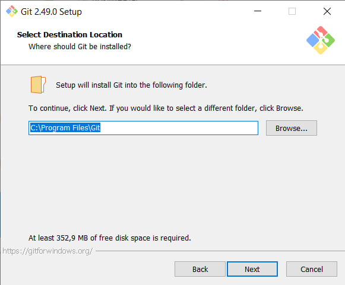


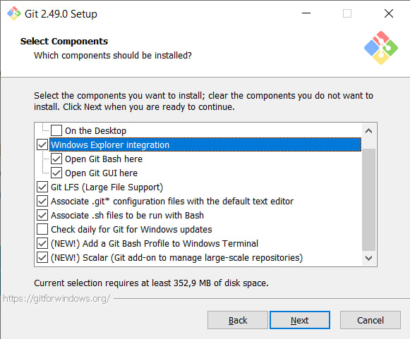

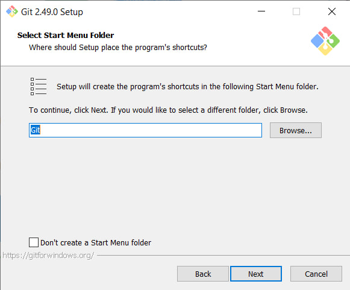

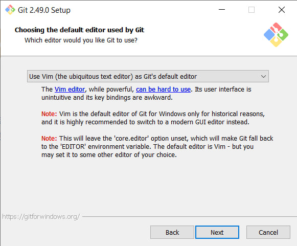


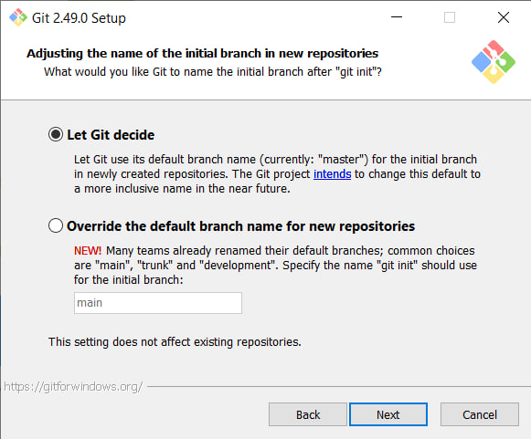

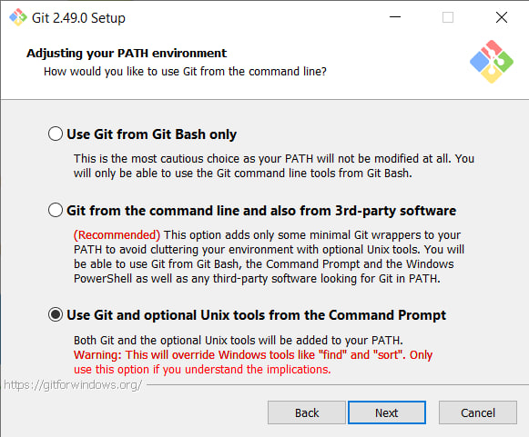

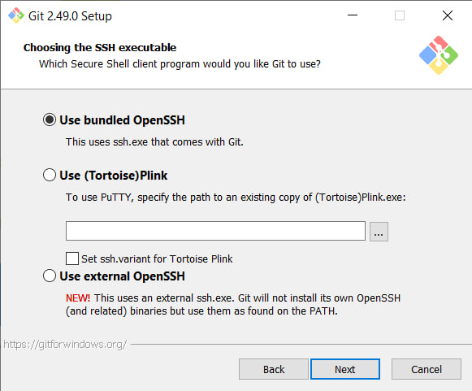

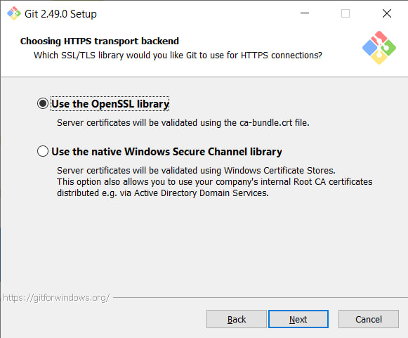

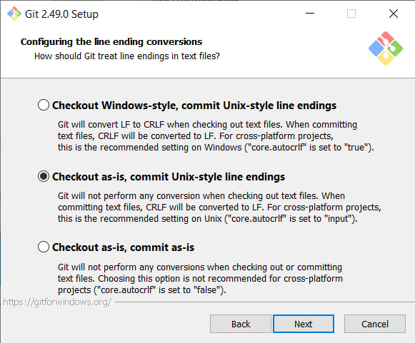

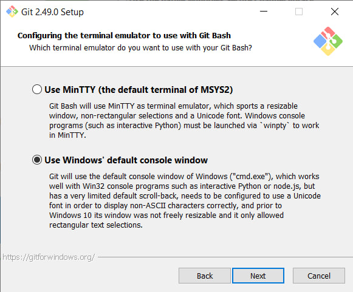

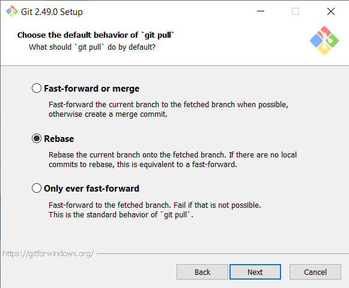

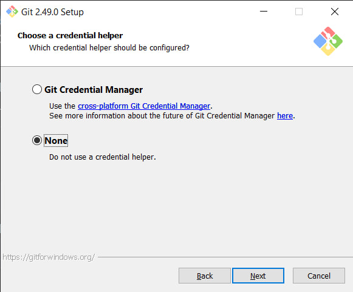

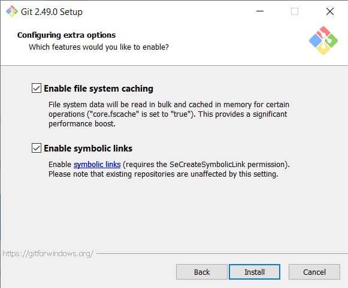

